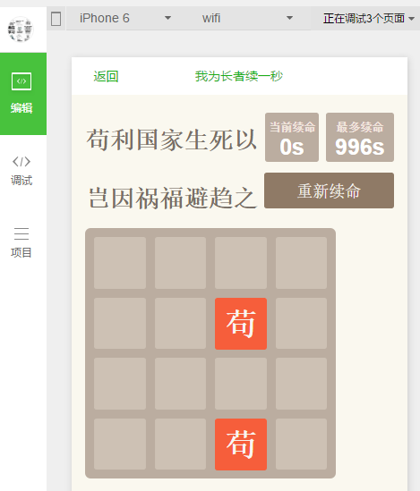

# 说明
基于[web版2048游戏](https://github.com/gabrielecirulli/2048)开发的微信小程序版2048。
不能运行的2048微信程序（https://github.com/natee/wxapp-2048）
原版程序不能在微信中运行，修改后才能运行
与微信程序示例结合才能运行
### 界面展示

### 相关资源

- [2048游戏]1.(https://github.com/gabrielecirulli/2048) 2. https://github.com/natee/wxapp-2048
- [微信小程序资源](https://github.com/justjavac/awesome-wechat-weapp)
- [微信小程序开发教程手册](http://www.w3cschool.cn/weixinapp/9wou1q8j.html)